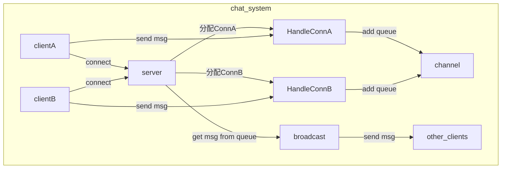

# Chat Socket
this is a chat example using Golang with socket.io.

owner by charlie liu

## option 1

use tcp build connect, loop connect accept. 
the message which received will have three events:
1. enter chat room
2. leave chat room
3. send message in room

when user don't send message which 10 minutes, server will kick off, and meanwhile broadcast 
this user has leave the current room.

## option 2

upgrade the protocol, use websocket instead.

# How to run


# Process Architecture



# Project Architecture
```
.
├── LICENSE
├── Makefile
├── README.md
├── bin
│   ├── tcp_client
│   └── tcp_server
├── cmd
│   └── tcp
├── conf
│   └── sys
├── go.mod
├── go.sum
├── internal
│   └── tcp
└── pkg
    ├── config
    ├── log
    └── util
```