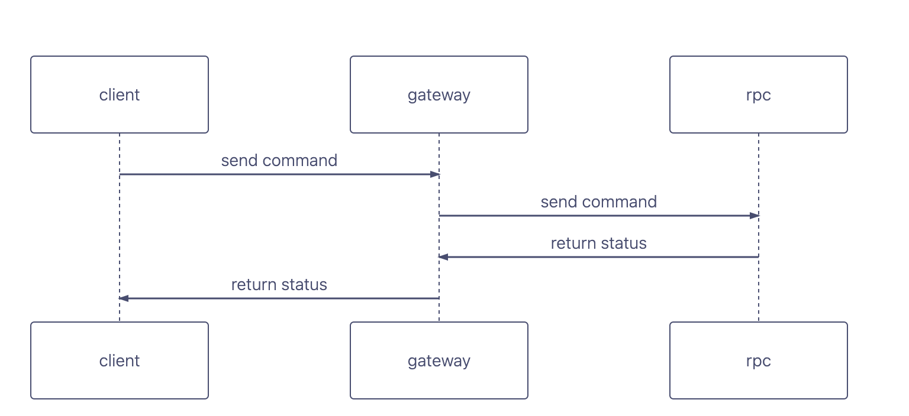
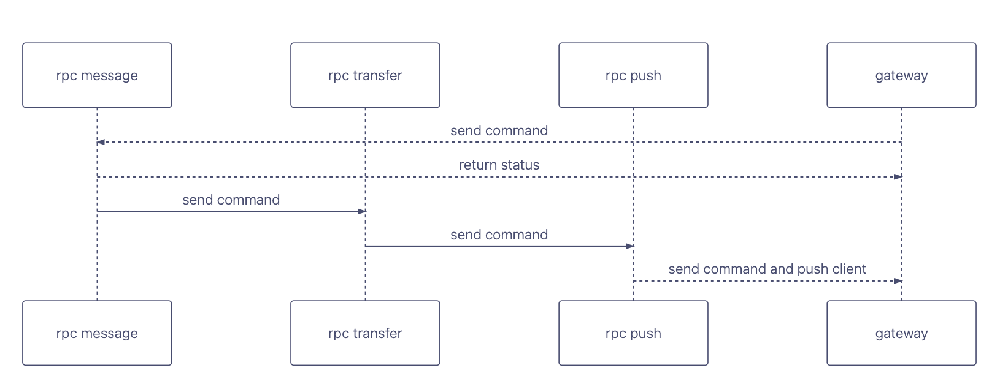

# ✨Chat Socket

Minimized chat demo to ensure the reliability and security of message.

* If you will familiar im project, run it.
* If you will familiar im component function quickly, run it.

# Project Directory Definition

```text
.
├── Makefile
├── README.md
├── client
├── server
```

# Project Structure

## General Structure



## Server Message Transfer Flow



# In-Depth Question

## Gateway

### How to achieve websocket pool?

> https://github.com/charlie-bit/websocket_conn_pool

### How to set logic deadline for gateway ws connection？

    > First, establish the connection between server and client
    > decided on the maximum amount of time you want to allow for a particular logic to complete
    > we can implement a timeout machanism

### How to set logic message size for gateway ws connection？

    > decied on incoing webscoket message sizeåå

### How to avoid gateway connection resource waste？

    >   websocket connection pool
    >   set idle deadline for conn 

### How to implement kick off user?

### How to implement user login in several platforms?

## Message

### How to ensure message safe?

    >   encryption websocket message
    >   auth when buildding ws connection

### How to ensure message timely transfer?

    >   keep-alive for ws connection
    >   heart beat for ws connection
    >   healthy network infrastructure

## Transfer

### How to storage message?

    >   storage message with no sql database
    >   use redis cache message seq(hot data)

```text
Notion

if need set ttl for message, can use insertOne with ttl. like

db.yourCollection.insertOne({
  content: "Your message content",
  createdAt: new Date(), // Current timestamp
  expiryTime: new Date(Date.now() + (60 * 60 * 1000)), // Set to expire in 1 hour
});
```

### What is the data retention policy in Kafka and how to configure it？

when build kafka component, set time base retention
`kafka-topics.sh --zookeeper localhost:2181 --alter --topic your-topic --config retention.ms=86400000`

## How to expend cluster model?

> https://github.com/charlie-bit/zk_demo
